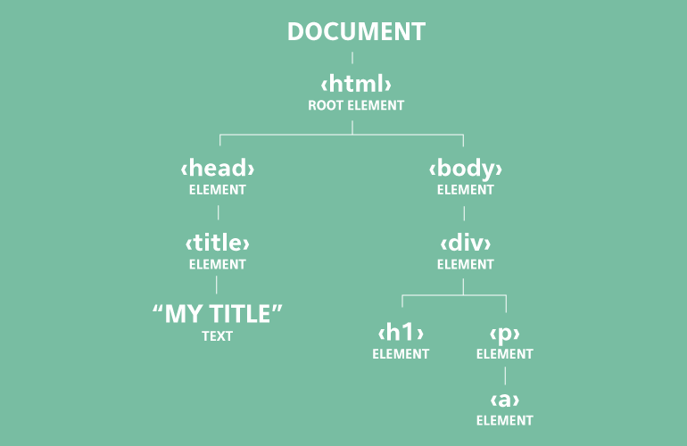

Web Primer: HTML, CSS and Javascript

---


### Introduction to HTML (Structure)

+++

### HTML =

* *HyperText* = Text with links
* *Markup* = Method of formatting
* *Language* = Collection of words and structures

Governance: World Wide Web Consortium (W3C). 

Age: 1993. Current version: 5.1. 

+++

### Basic Structure

```html
<!DOCTYPE html>
<html>
  <head>
    <title>Webpage Title</title>
  </head>
  <body>

  </body>
</html>
```
@[1-9](HTML "tags" form the "page source". Invisible to user, but with CSS and JS allow us to present almost anything.)
@[1,2,9](HTML Tag tells browser that the content uses HTML)
@[3,5,6,8](Has a head and a body)
@[4](Title tag determines what shows in the browser tab)
@[5,8,9](Note that almost every tag must have a corresponding closing tag. <br/>Exceptions look like this `<tag/>`.)

+++

### Basic Tags & Attributes

```html
<body>
  <div id="ADivContainer">
  <h1>My Section Heading</h1>
    <p>This is paragraph text with a link to 
    <a href="http://w3schools.org" target="_blank">W3Schools</a> 
    which<br/>is a useful resource.</p>
  </div>
</body>
```
@[2,7](`div`s (and `span`s) are the building blocks of most pages)
@[3-6](Display some text! A heading followed by a paragraph with a link and a line break.)
@[2,5](Note the use of **"attributes"** - `id`, `href` and `target`)
@[5](See also Mozilla Developer Network, StackOverflow.)

+++

### HTML: Exercize 1

Use an editor to try to create an HTML page to display something that looks a little like the image below. 
* Use w3schools or another resource to look up the tags you'll need.
* Save your creation as a *filename*.html file and then try opening it in a browser.


Stretch goals: Add a link, and/or add an image, and put a red border around it.

+++

### HTML: Exercize 1 - FollowUp

Great resources exist for trying things out without the need for a local editor. These include:

* [CodePen](https://codepen.io) and [JSFiddle](https://jsfiddle.net/)
* [W3 Schools - "Try It Yourself"](https://www.w3schools.com)

**Experiment!**

---


### Introduction to CSS (Presentation)

+++

### In the beginning...

...we used basic HTML tags for formatting:
```html
<p>This text demonstrates the use of 
<b>bold</b> (correct "semantic html" is <strong>strong</strong>), 
<i>italic</i> (<em>em</em>), and 
<big>big <u>underlined</u></big> text.
</p>
```
@[2]("Semantic HTML" - tags with meaning)

(See the result at [this CodePen](https://codepen.io/accack/pen/RjmzOJ)). There are better ways than simple HTML tags for styling...

+++

### The HTML `<Style>` Attribute

```html
<h1 style="color:blue; text-decoration: blink;>
This is a Blue Heading</h1>`
```

Style attributes can set almost anything - background, border, font, margins, transparency, etc.

But what if we want every occurance of an element to have the same style? Add it to each one? Is there a better way?

+++

### Style Sheets

```html
<head>
  <style>
    body {background-color: powderblue;}
    h1   {color: blue;}
    p    {color: red;}
  </style>
</head>
<body>
  <h1>This is a heading</h1>
  <p>This is a paragraph.</p>
</body>
```
@[1-11](Discuss...)
@[2-6](A basic (inline) stylesheet)
@[1-11](What's this going to look like? (Answer [here](https://www.w3schools.com/html/tryit.asp?filename=tryhtml_css_internal)))

+++

### Classes and Identifiers

```html
<style>
  li {  font-family: Arial, Helvetica, sans-serif; 
        font-size: 20px; color: blue;
        font-style: normal; }
  .nameStyling {  font-family: Times New Roman, serif; 
        font-size: 18pt; color: #0000FF; }
  #secondItemName {  color: red; }
</style><!--...-->
<ol>
  <li>1st list item, with a <span class="nameStyling">Name</span></li>
  <li>2nd list item, with a 
  <span class="nameStyling" id="secondItemName">Unique Name</span></li>
</ol>
```
@[2-4,10-12](Defining style by tag)
@[5-6,10-12](Defining style by class)
@[7,12](Defining style by id. Note combined class and id use.)
@[2-7](Note different ways of defining font, size and color.)
@[2-13](See result at [this CodePen](https://codepen.io/accack/pen/wPLwaz?editors=1000#))

+++

### Linking to other files

What if we want to share styles between pages, or even sites? Or if we just want to break things up to make them more manageable?
```html
<head>
  <link rel="stylesheet" href="styles.css">
</head>
```

Code above references a seperate file, styles.css:
```css
li { font-size: 20px; color: blue; }
.nameStyling { font-family: Times New Roman, serif; }
#secondItemName { color: red; }
```

+++

### CSS Exercize

* Format the bullet points on your page using an external css file.
* Try adding some other classes and styles, e.g. page background, text alignment

---

HTML & CSS - Useful tools & Concepts

### #1: An Introduction to Chrome DevTools (Elements & DOM)

Right click on any page and choose "Inspect".
The Elements tab provides lots of great HTML & CSS stuff.

+++

### The Document Object Model (DOM)



+++

### DevTools Exercize

* Open the page you created previously and use DevTools to explore the DOM and classes.
* Make some changes using DevTools only (e.g. change page background, bullet point text or formatting).
* Refresh the page. What happens?

---

HTML & CSS - Useful tools & Concepts
### #2: An Introduction to Chrome DevTools (Console)

The Console tab/window in DevTool:

1. Displays details of any problems when loading the page
2. Allows you to query the page (and run commands against it), using JavaScript and "JQuery".

+++

### Exercise

* With your page loaded, open the DevTools Console, and type in `document.getElementByTag('head')`
* Experiment with other elements on the page.

---


### Introduction to JS (Behaviour)

+++

### JavaScript is not the same as Java!

Any more than Ham is the same as Hamburger.

* Simple scripting language.
* Primary use is front-end functionality, but increasingly being used for back-end.
* Note: `document.getElementByTag('head')` in the previous exercise was an example of JavaScript.

+++

### A simple example

```html
<html><body>

<h2>My First JavaScript</h2>

<button type="button"
onclick="document.getElementById('demo').innerHTML = Date()">
Click me to display Date and Time.</button>

<p id="demo"></p>

</body></html> 
```
@[1-11](Discuss)
@[5-7](Button, with text 'Click me to display Date and Time.')
@[6](`onclick` handler to run a piece of JS when button is clicked)
@[6](Finds item with ID 'demo' in the DOM, and sets its 'innerHTML' to today's date.)
@[1-11](Click [here](https://www.w3schools.com/js/tryit.asp?filename=tryjs_myfirst) to try this.)

+++

### That's the introduction!

Note that, as with CSS, you can import JS in files by adding a tag as follows:
```html
<script src="https://address.com/location/script.js"></script>
```
Over to Martin, for more on JavaScript...

---

