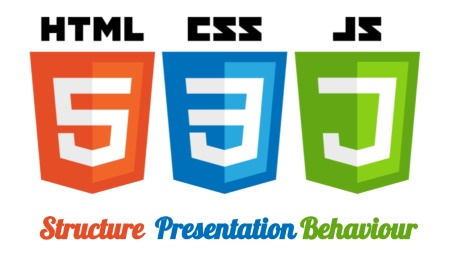
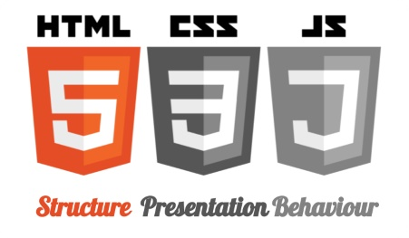
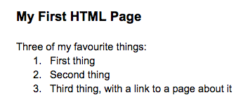
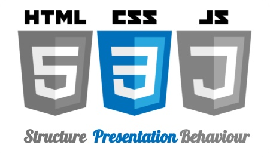
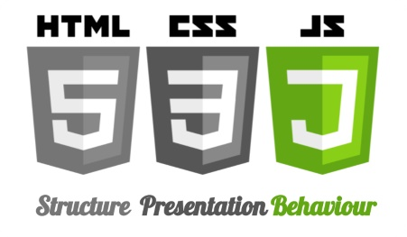

Web Primer: HTML, CSS and Javascript
---


## Introduction to HTML (Structure)

HyperText Markup Language:

* *HyperText* = Text with links
* *Markup* = Method of formatting
* *Language* = Collection of words and structures

Governance: World Wide Web Consortium (W3C). 

Age: 1993. Current version: 5.1. 

+++
## HTML: Basic Structure

```html
<!DOCTYPE html>
<html>
  <head>
    <title>Webpage Title</title>
  </head>
  <body>

  </body>
</html>
```
@[1-9](HTML "tags" form the "page source". Invisible to user, but with CSS and JS allow us to present almost anything.)
@[1,2,9](HTML Tag tells browser that the content uses HTML)
@[3,5,6,8](Has a head and a body)
@[4](Title tag determines what shows in the browser tab)
@[5,8,9](Note that almost every tag must have a corresponding closing tag. <br/>Exceptions look like this `<tag/>`.)
+++
## HTML: Basic Tags & w3schools

```html
<body>
  <div id="ADivContainer">
  <h1>My Section Heading</h1>
    <p>This is paragraph text with a link to 
    <a href="http://w3schools.org" target="_blank">W3Schools</a> 
    which<br/>is a useful resource.</p>
  </div>
</body>
```
@[2,7](`div`s (and `span`s) are the building blocks of most pages)
@[3-6](Display some text! A heading followed by a paragraph with a link and a line break.)
@[5](See also Mozilla Developer Network, StackOverflow.)
+++
### HTML: Exercize One

Use an editor to try to create an HTML page to display something that looks a little like the image below. 
* Use w3schools or another resource to look up the tags you'll need.
* Save your creation as a filename.html file and then try opening it in a browser.



Stretch goals: Add a link, and/or add an image, and put a red border around it.
+++
### HTML: Exercize One - FollowUp

Great resources exist for trying this things out without the need for a local editor. These include:

* [CodePen](https://codepen.io) and [JSFiddle](https://jsfiddle.net/)
* [W3 Schools - "Try It Yourself"](https://www.w3schools.com)

**Experiment!**
---

## Introduction to CSS: Presentation
+++
## In the beginning...

...we used basic HTML tags for formatting:
```
<p>This text demonstrates the use of 
<b>bold</b> (correct "semantic html" is <strong>strong</strong>?), 
<i>italic</i> (<em>em</em>), and 
<big>big <u>underlined</u></big> text.
</p>
```
(See the result at [this CodePen](https://codepen.io/accack/pen/RjmzOJ)). These tags demonstrate how early styling was done in html. Better ways were developed...
+++
## The HTML `<Style>` Tag

`<h1 style="color:blue;">This is a Blue Heading</h1>`

Style attributes can set almost anything - background, border, font, margins, transparency, etc.

But what if we want every occurance of an element to have the same style? Add it to each one? Is there a better way?
+++
## Style Sheets
```
<head>
  <style>
    body {background-color: powderblue;}
    h1   {color: blue;}
    p    {color: red;}
  </style>
</head>
<body>
<h1>This is a heading</h1>
<p>This is a paragraph.</p>
</body>
```
@[1-16](Discuss...)
@[4-9](A basic (inline) stylesheet)
@[1-16](What's this going to look like? (Answer [here](https://www.w3schools.com/html/tryit.asp?filename=tryhtml_css_internal)))
+++
### HTML: Classes and Identifiers
```
<style>
  li {  font-family: Arial, Helvetica, sans-serif; 
        font-size: 20px; color: blue;
        font-style: normal; }
  .nameStyling {  font-family: Times New Roman, serif; 
        font-size: 18pt; color: #0000FF; }
  #secondItemName {  color: red; }
</style>...
<ol>
  <li>1st list item, with a <span class="nameStyling">Name</span></li>
  <li>2nd list item, with a <span class="nameStyling" id="secondItemName">
  Unique Name</span></li>
</ol>
```
@[3-6,15-17](Defining style by tag)
@[7-9,16-17](Defining style by class)
@[10,17](Defining style by id. Note combined class and id use)
@[3-10](Note different ways of defining font, size and color)

See result at [this CodePen](https://codepen.io/accack/pen/wPLwaz?editors=1000#)
---
## HTML: Using Other Files
What if we want to share styles between pages, or even sites? Or if we just want to break things up to make them more manageable?
```
<head>
  <link rel="stylesheet" href="styles.css">
</head>
```
styles.css:
```
li { font-size: 20px; color: blue; }
.nameStyling { font-family: Times New Roman, serif; }
#secondItemName { color: red; }
```
+++
## Exercize

Format the bullet points on your page using an external css file.
---
HTML & CSS - Useful tools & Concepts
## #1: An Introduction to Chrome DevTools (Elements & DOM)

Right click on any page and choose "Inspect".
The Elements tab provides lots of great HTML & CSS stuff.
+++
## 
+++
## Exercize

Open the page you created previously and make some changes using DevTools only
---
HTML & CSS - Useful tools & Concepts
## #2: An Introduction to Chrome DevTools (Console & JQuery)

### CSS Files
---
+++
### HTML: Style attributes and the Box Model

https://www.w3schools.com/html/html_styles.asp

+++
## HTML: An Introduction to Chrome DevTools
### HTML: Exercize Three

Format the bullet points on your page using an external css.
---


