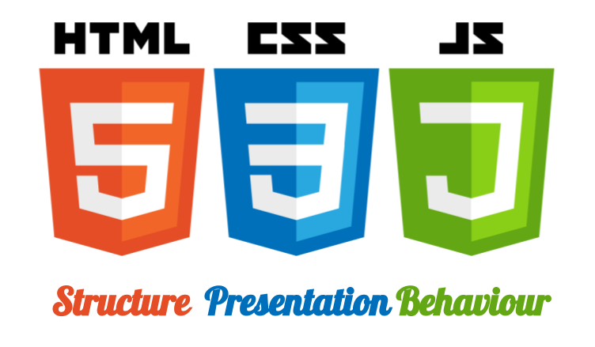

Web Primer: HTML, CSS and Javascript
---
## Introduction to HTML

### HTML - HyperText Markup Language

* *HyperText* = Text with links
* *Markup* = Method of formatting
* *Language* = Collection of words and structures

---

* HTML is the structure behind almost all web pages, and the latest version, along with CSS and Javascript allows us to present almost anything.
* HTML "tags" form the page "source", and are not displayed to the user, but they are instrumental in structuing what the user does see. 
* The World Wide Web Consortium (W3C) guides development and since 1993 there have been 5 major versions.

---
### HTML: Basic Structure

```html
<html>
  <head>
    <title>My First Website</title>
  </head>
  <body>

  </body>
</html>
```
@[1,8](Tells browser that the content uses HTML)
@[2,4,5,7](Has a head and a body)
@[3](Title tag determines what shows in the browser tab)
@[3,4,7,8](Note that almost every tag most have a corresponding closing tag. <br/>Exceptions look like this `<tag/>`.)
---
### HTML: Basic Tags & w3schools

```html
<body>
  <div id="MyFirstDiv">
  <h1>My Section Heading</h1>
    <p>This is paragraph text with a link to 
    <a href="http://w3schools.org" target="_blank">W3Schools</a> 
    which<br/>is a really useful resource.</p>
  </div>
</body>
```
@[2,7](`div`s (and `span`s) are the building blocks of most pages)
@[3-6](Display some text! A heading followed by a paragraph with a link and a line break.)
---
### HTML: Exercize One

Use an editor on your Mac to try to create an HTML page to display something that looks a little like the image below. 
* Use your cheatsheet, w3schools or another resource to look up the tags you'll need.
* Save your creation as a filename.html file and then try opening it in a browser.


---
